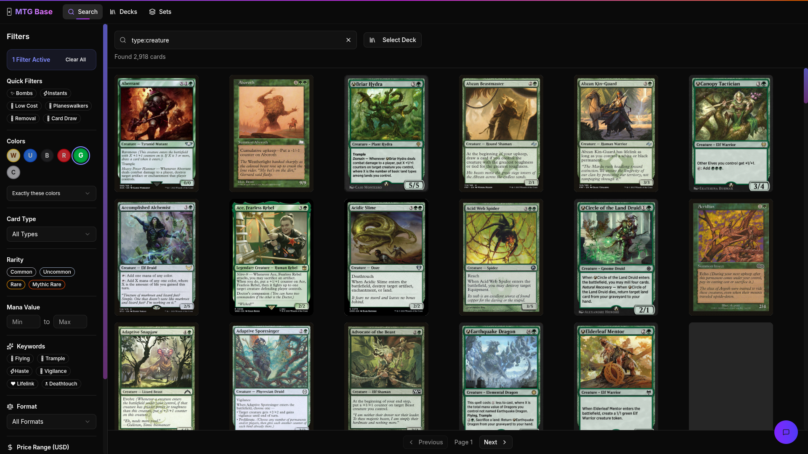

# MTG Base

A modern, backendless Magic: The Gathering card database and deck builder. All your decks are saved locally in your browser.



## Features

- 🔍 **Card Search** - Search the entire MTG card database with advanced filters (colors, type, rarity, mana value, keywords)
- 🃏 **Deck Builder** - Create and manage decks for various formats (Commander, Standard, Modern, etc.)
- 📚 **Set Browser** - Browse cards by expansion set
- 👑 **Commander Browser** - Explore top commanders and sample decklists via EDHREC integration
- 👑 **AI Assistant** - Get some fresh ideas from Grok when building your deck


## Tech Stack

- **React 19** + TypeScript
- **Vite** - Build tool
- **Tailwind CSS 4** - Styling
- **Redux Toolkit** - State management
- **React Query** - Data fetching & caching
- **Radix UI** - Accessible components
- **Framer Motion** - Animations
- **Scryfall API** - Card data
- **EDHREC API** - Commander data

## Getting Started

```bash
npm install
npm run dev
```
